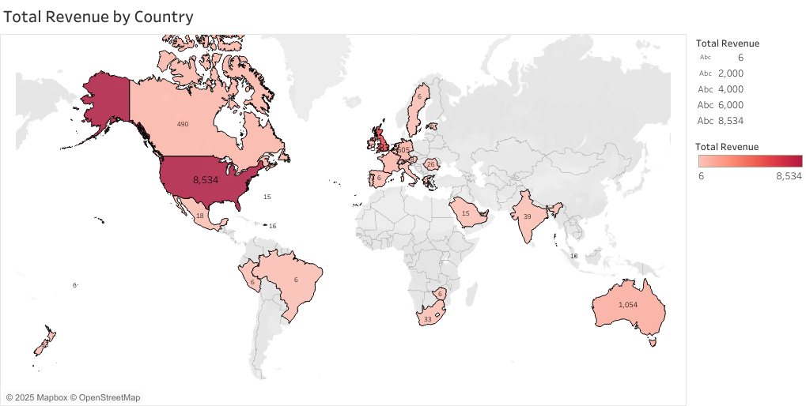

# Project Background

On this project the focus is on analysis of sales transaction data from an Etsy store between 2022 to 2025. The primary objective was to provide data-driven insights to the store owner, who is facing a decline in sales and some issues with physical products.

You can see the SueArtCo Etsy Store [here](https://www.etsy.com/pt/shop/SueArtCoShop)

The Tableau dashboard can be seen [here](https://public.tableau.com/views/SueArtCoAnalysis/TotalRevenuebyCountryDB?:language=en-GB&:sid=&:redirect=auth&:display_count=n&:origin=viz_share_link)

The R codes used to Clean and Prepare the data can be seen [here](sql/Cleaning_and_preparing)

The R codes used to regarding the business questions can be seen [here](sql/Analytical_Queries)

# The Key Goals of this Analysis

Overall Performance Trends: To understand the general year-over-year, monthly, and quarterly revenue

Physical and Digital Product Performance: Make comparison of sales performance between physical and digital products over time, check revenue and order volume trends, average prices, and the proportion of each product type in total sales.

Product Performance Analysis: Identify top-performing and least-performing products from both physical and digital by units sold and total revenue, highlighting the items that contribute to sales or might require attention.

Customer & Geographic Insights: Understand where the customers are buying from, and identify preferences for physical or digital products.

## Data Structure and Initial Checks

Down below you can see the data structure from the SueArtCo sales with a total of 1950 records

 

## Executive Summary

This project undertook a comprehensive data analysis of Etsy sales records from 2022 to 2025, aimed at providing the store owner with actionable insights to address a suspected decline in performance.

## Some Key Findings

The analysis indicated that the owner's hypothesis was largely supported: the observed decline in overall sales performance was significantly driven by a disproportionate decrease in revenue and order volume from physical products over the period. While digital products showed more stability or even growth in certain periods.

Most revenue by country was concentrated in United States(£8534) and United Kingdom(£5832), followed by Australia(£1054), Germany(£605) and Canada(£490). As you can see on the map visualisation below.

The analysis of individual listings revealed clear top-performers. The most sold products were predominantly Superhero Art Print set of 3, the digital Wall Art Gift, and Superhero Art Print set of 3, but the physical version of the product, indicating strong market demand or effective listing strategies for these items. 

Conversely, the store has some items with zero sales. Some are physical and others are digital, this can idicate high shipping costs and for the digital products a low demand or bad listing strategies for these specific products. we can also see some very low performance on some others products such as Road Trip Scavenger Hunt and Personalised Wish Party Stickers.

## Total Revenue by Country

We can see a clear dominance from the United States, generating the highest amount of revenue(£8534), followed by the United Kingdom with a strong revenue of £5832 and Australia with £1054.

There's a strong dominance from the English-Speaking Regions, like Australia and Canada, even with the most sold items been from products that have no connections of English language on the products itself (You can see this from the Dashboard with Most and Least sold products).

Revenue generation is highly concentrated in the United States, United Kingdom and Australia, suggesting these are the core customer bases for the store.

Most of other countries worldwide shows a very low revenue. This highlights either a limited customer base, lack of marketing penetration, logistical challenges, or the website (Etsy) not been strong in these regions.

## Most and Least Sold Products

The digital invitation is driving the top revenue with the absolute highest perform is the "Personalised Party Invitation | Digital Phone Invitation" and "Personalised Video Party Invitation". It indicates an effective positioning for these items, as it looks like it indicates a strong marketing demand, we need to see that most of the sales were on COVID time and now the digital invitation is not on high demand.

We can see a very surprise success from a physical product, even with a decline in physical sales, with the "Superhero Art Print set of 3 | Home Decor | Poster Wall Art Gift" standing out with the second most revenue. Showing that not all physical items follow the negative trend. Another excellent physical item doing well is the "Personalised Car Cake Stickers", is doing really well in revenue in the last few months.

On the other hand with a very low revenue we can see the "Personalised Wish Party Stickers", this can be from a demand from a specific niche at the moment as it depends on movies demand of the time.

## Average Price and Total Revenue

The digital products have the highest average price per unit (approx. £7.46) compared to physical products (approx. £6.78). Digital products demonstrate strong market demand and can command a slightly higher average price, benefiting from their minimal operational costs (no materials or delivery fees), presenting a clear advantage over physical goods.

Both Digital and Physical product categories experienced their highest revenue peak in 2023. However, both product types show a decline in total revenue in 2024 and into 2025. Even with the decline in revenue, digital products continue to show a good overall revenue (with 61.58% of the revenue coming from digital products), reinforcing their importance to the business's structure.

## Monthly Trends by Year

 2023 was the peak year of the store, with the line charts showing the strongest year for monthly revenue, specially with high sales in the early months(January-March).

In the following years, we can see a decline in revenue post 2023. This could be caused for an increase in competition, the rising costs from the physical products with the crises that we are still facing from post COVID period, outdated designs or a shift to market products for a more digital item.

Even with the decline in sales, we can see some revenue trends from this store more at the end of the year, with an increase in sales in August and coming back to an increase in October until December. 

## Recommendations

The data clearly indicates a significant decline in overall revenue and order volume after 2023, specially impacting physical products, but also showing a decline in digital sales from their 2023 peak.

Primary focus should be in expanding your digital product catalogue, focusing on new and trending printable designs, digital downloads, and customizable templates. As the digital products are the top revenue and has the slightly higher average price per product(£7.46 vs. £6.78 for physical) and with minimal operational costs (no materials, no shipping fees, no physical inventory). Also optimize the existing high-performing digital listings for a better SEO inside Etsy website.

While we can see a big decline from physical products from the peak in 2023, the "Superhero Art Print set of 3" demonstrates that not all physical products are failing. Focusing in creating new physical products in the same niche, as the "Superhero Art Print set of 3", can be an excellent strategy to increase revenue.

For low performing physical products, explore options like re-designing, re-pricing, bundling, or ultimately, discontinuing them to reduce inventory costs, production time.

Focus where your audience is. The data shows that the majority of your audience is from the United States, with a strong market in the UK, Australia and Canada as well, use social media in your favour, post your products, use coupons and create bundles, specially for digital products to attract more potential buyers and increase average order value.

By implementing these recommendations, the store owner can address the observed revenue decline, focus in the digital product space, and make data-informed decisions for a more profitable business.

